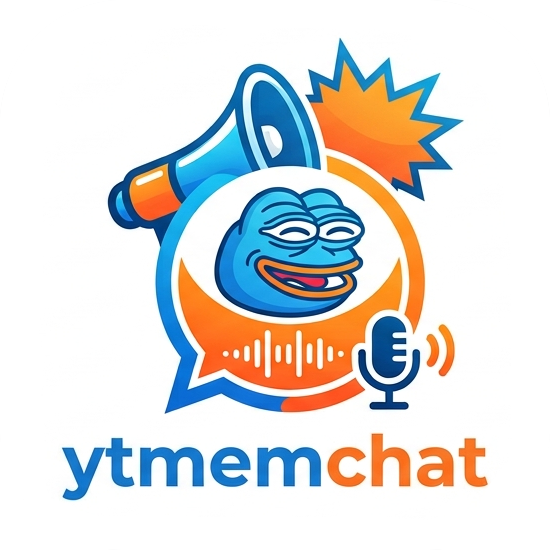
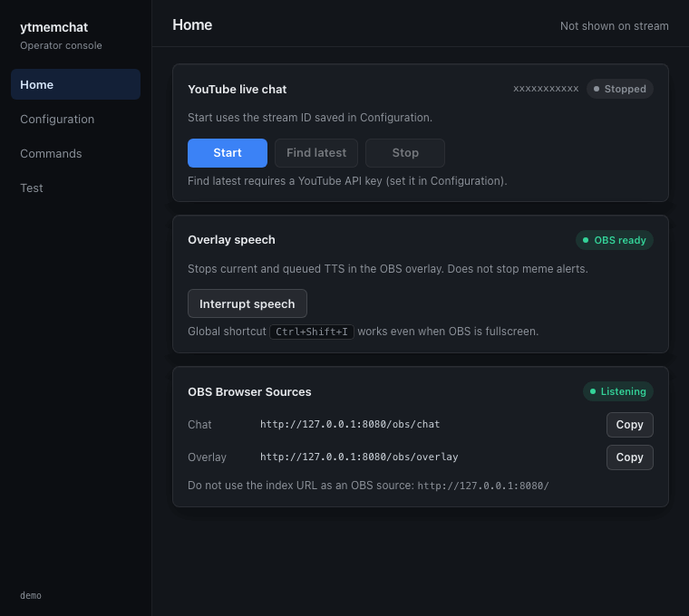

# ytmemchat

<p align="center">
  
</p>

ytmemchat is a desktop companion for [YouTube](https://www.youtube.com/) Live. It reads live chat and drives an [OBS](https://obsproject.com/) overlay: on-stream messages, meme alerts, and text-to-speech.

This repository is a [Wails](https://wails.io) + [Svelte](https://svelte.dev) desktop app. You configure and start the pipeline in a native window. OBS Browser Sources load local HTTP pages that update over WebSocket. The Wails window is a control panel; it is not the on-stream chat renderer.

**Project status:** early development. Start/Stop YouTube chat from Home. Alerts and TTS play on the overlay.

## Features

- Live YouTube chat (history skipped on connect); optional [Data API v3](https://developers.google.com/youtube/v3) key
- Home / Configuration / Commands / Test window
- OBS chat and alert/TTS overlay over HTTP + WebSocket
- Alert commands (for example `@jump`) and TTS (macOS `say`, Windows PowerShell, Linux `espeak`)
- Optional HTTP API and a Test pane to inject a fake chat line

<p align="center">
  
</p>

## Installation

### Download

Download a tagged archive from [GitHub Releases](https://github.com/HardDie/ytmemchat_wails/releases) (Linux amd64/arm64, Windows amd64, macOS universal). Files are named `ytmemchat-<tag>-<os>-<arch>` (for example `ytmemchat-v0.1.0-darwin-universal.zip`). Binaries are not code-signed yet. On macOS, [open the unsigned app](https://github.com/HardDie/ytmemchat_wails/wiki/Running-on-macOS). The window sidebar shows the git tag, or the short commit the binary was built from.

### From source

Requires Go 1.25+, Node/npm, [Wails CLI](https://wails.io/docs/gettingstarted/installation); macOS Xcode CLT, Windows WebView2, Linux Wails packages.

```bash
git clone https://github.com/HardDie/ytmemchat_wails.git
cd ytmemchat_wails
make build
```

`make dev` runs the app with frontend hot reload. Tests, screenshots, and package docs are on [Contributing](https://github.com/HardDie/ytmemchat_wails/wiki/Contributing).

## Usage

Follow [Getting Started](https://github.com/HardDie/ytmemchat_wails/wiki/Getting-Started). In short: set a live **stream/video ID** on Configuration, copy the Browser Source URLs from Home, then **Start**.

| OBS source | URL (default port `8080`) |
|---|---|
| Chat | `http://127.0.0.1:8080/obs/chat` |
| Alerts + TTS | `http://127.0.0.1:8080/obs/overlay` |

Do not use `http://127.0.0.1:8080/` as an OBS source. Chat query parameters (`transparent`, `fontSize`, `textColor`) are on [Chat URL](https://github.com/HardDie/ytmemchat_wails/wiki/Chat-URL). Overlay needs **Interact** once so audio can autoplay.

Alerts and TTS are off until you enable them. See [Configuration](https://github.com/HardDie/ytmemchat_wails/wiki/Configuration), [Commands](https://github.com/HardDie/ytmemchat_wails/wiki/Commands), and [YouTube API key](https://github.com/HardDie/ytmemchat_wails/wiki/YouTube-API-key).

## Documentation

| Doc | Audience |
|---|---|
| This README | Product, install, OBS URLs, status |
| [Wiki](https://github.com/HardDie/ytmemchat_wails/wiki) | Operator how-tos (source: `docs/wiki/`) |
| [Contributing](https://github.com/HardDie/ytmemchat_wails/wiki/Contributing) | Make targets, tests, package docs |
| [CURSOR.md](CURSOR.md) | Contributors/agents: contracts |
| [docs/architecture](docs/architecture/INDEX.md) | ADRs |
| [docs/use-cases](docs/use-cases/INDEX.md) | Scenarios for ported modules |

## Support

Use the GitHub issue tracker. The original console app is [HardDie/ytmemchat](https://github.com/HardDie/ytmemchat).

## Authors

Desktop port of [HardDie/ytmemchat](https://github.com/HardDie/ytmemchat).

## License

This project is licensed under the GNU General Public License v3.0 — see the [LICENSE](LICENSE) file for details.
