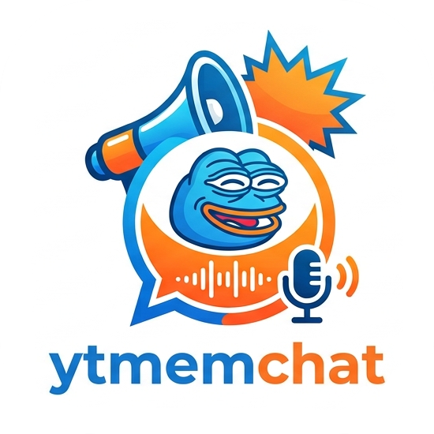
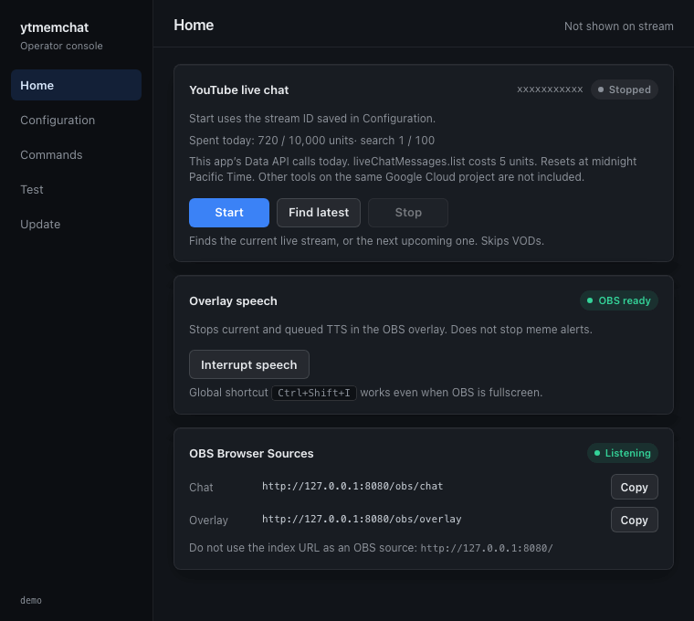

# ytmemchat

<p align="center">
  
</p>

ytmemchat is a desktop companion for [YouTube](https://www.youtube.com/) Live. It reads live chat and shows it in [OBS](https://obsproject.com/): on-stream messages, meme alerts, and text-to-speech.

## Who it's for

YouTube Live streamers with a small audience who want every viewer to take part for free.

A viewer types a command in chat. A visual alert shows on top of the stream, or an audio command plays. The streamer can also read text messages aloud, so each line is heard. Viewers feel noticed and stay involved.

The app window only controls ytmemchat. OBS or a browser loads the pages. The chat page lists messages. The overlay page plays clips and speech.

**Project status:** ready to use. Start and stop YouTube chat from Home. Alerts and text-to-speech, once enabled, play on the OBS overlay.

## Features

- Live YouTube chat. Lines already in chat before Start are skipped. A [YouTube Data API v3](https://developers.google.com/youtube/v3) key is optional.
- Window panes: Home, Configuration, Commands, Test, Update
- An OBS chat page, and an overlay page for alerts and speech
- Alert commands (for example `@jump`) and text-to-speech (macOS `say`, Windows PowerShell, Linux `espeak`)
- A Test pane to send a fake chat line, plus an optional local HTTP API

<p align="center">
  
</p>

## Installation

### Download

Download a tagged archive from [GitHub Releases](https://github.com/HardDie/ytmemchat_wails/releases) for Linux (amd64, arm64), Windows (amd64), or macOS (universal).

Files are named `ytmemchat-<tag>-<os>-<arch>`. For example, `ytmemchat-v0.1.0-darwin-universal.zip`.

Binaries are not code-signed yet. On macOS, [open the unsigned app](https://github.com/HardDie/ytmemchat_wails/wiki/Running-on-macOS). The window sidebar shows the release tag, or the short commit the binary was built from.

### From source

This repository is a [Wails](https://wails.io) + [Svelte](https://svelte.dev) app. Building it needs Go 1.25+, Node/npm, and the [Wails CLI](https://wails.io/docs/gettingstarted/installation).

macOS also needs Xcode Command Line Tools. Windows needs WebView2. Linux needs the Wails packages.

```bash
git clone https://github.com/HardDie/ytmemchat_wails.git
cd ytmemchat_wails
make build
```

`make dev` runs the app with frontend hot reload. Tests, screenshots, and package docs are on [Contributing](https://github.com/HardDie/ytmemchat_wails/wiki/Contributing).

## Usage

Follow [Getting Started](https://github.com/HardDie/ytmemchat_wails/wiki/Getting-Started). You do not need a YouTube API key.

Set a live **stream/video ID** on Configuration, copy the **Chat** URL from Home, then **Start**. Alerts and text-to-speech stay off until you turn them on.

| OBS source | URL (default port `8080`) |
|---|---|
| Chat | `http://127.0.0.1:8080/obs/chat` |
| Alerts + TTS | `http://127.0.0.1:8080/obs/overlay` |

The overlay URL is for clips and speech. The index URL (`http://127.0.0.1:8080/`) lists these two pages. Do not use it as an OBS source.

Chat query parameters are on [Chat URL](https://github.com/HardDie/ytmemchat_wails/wiki/Chat-URL).

Meme alerts are [Setting up commands](https://github.com/HardDie/ytmemchat_wails/wiki/Setting-up-commands). Speech is [Text to speech](https://github.com/HardDie/ytmemchat_wails/wiki/Text-to-speech).

The [Commands](https://github.com/HardDie/ytmemchat_wails/wiki/Commands) editor, a [YouTube API key](https://github.com/HardDie/ytmemchat_wails/wiki/YouTube-API-key), and [Test](https://github.com/HardDie/ytmemchat_wails/wiki/Test) are for later. [Configuration](https://github.com/HardDie/ytmemchat_wails/wiki/Configuration) lists every setting.

## Documentation

| Doc | Audience |
|---|---|
| This README | Product, install, OBS URLs, status |
| [Wiki](https://github.com/HardDie/ytmemchat_wails/wiki) | Setup guides (source: `docs/wiki/`) |
| [Contributing](https://github.com/HardDie/ytmemchat_wails/wiki/Contributing) | Make targets, tests, package docs |
| [CURSOR.md](CURSOR.md) | Contributors/agents: contracts |
| [docs/architecture](docs/architecture/INDEX.md) | ADRs |
| [docs/use-cases](docs/use-cases/INDEX.md) | Scenarios for ported modules |

## Support

Use the GitHub issue tracker. The original console app is [HardDie/ytmemchat](https://github.com/HardDie/ytmemchat).

## Authors

Desktop port of [HardDie/ytmemchat](https://github.com/HardDie/ytmemchat).

## License

This project is licensed under the GNU General Public License v3.0 — see the [LICENSE](LICENSE) file for details.
